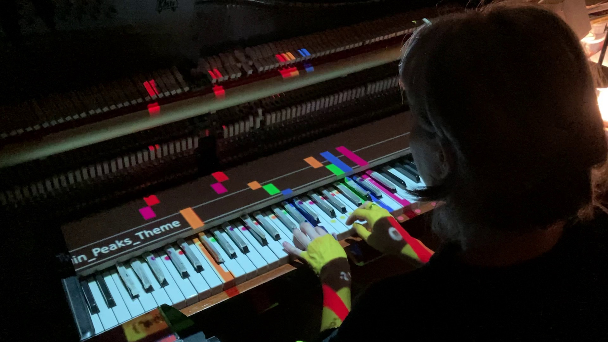

# Videopiano
Videopiano is a playful animated piano installation that makes it easy to start playing music without any musical knowledge. Videopiano is an original concept from 2009 by Timo Toots and Eve Arpo. Since 2020 it is being developed as open source project.

Hire us for customizations, installations for exhibitions etc at [www.masinism.ee.](https://www.masinism.ee)

Videopiano could be used as a museum exhibit, musical presentation or just a game. Home use is also possible as the hardware is not expensive. Old piano collecting dust? Build Videopiano!

# Music copyright
We do not own any copyrights for music. For public exhibits the rights to present music must be organized by the venue. For home use you can play along online videos of Linthesia, Neothesia, MIDI Vizualizer, Synthesia and similar software.

# Creating videos
* You can create your own videos as well. 

# Hardware requirements:
* piano or MIDI keyboard
* video projector
* Raspberry Pi 3 or faster

# Possiblities
There are several ways to use Videopiano.

## Gamified Videopiano
* use MIDI keyboard
* use software Linthesia with your MID files

## Playalong Videopiano
* use real piano, electric piano etc
* use included videoplayer for online video recordings

# License
* Open source / license soon
* Please hire us for customizations, installations for exhibitions etc. [www.masinism.ee.](https://www.masinism.ee)

